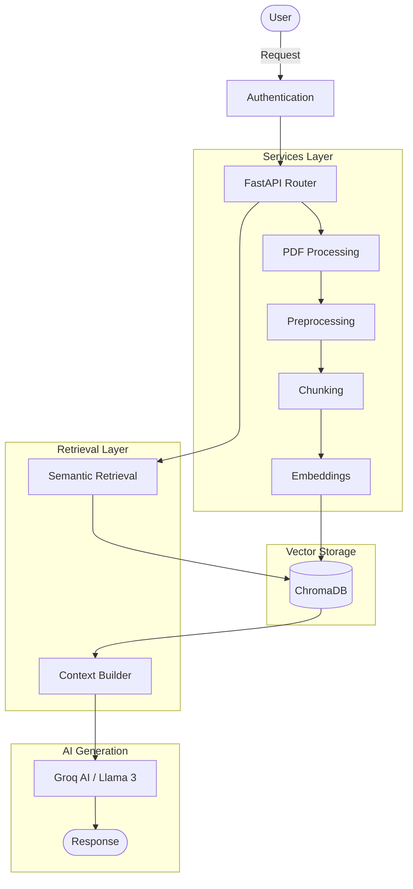

# Qamar Tutor – AI-Powered Educational Assistant


Qamar Tutor is a production-ready AI backend engineered for educational assistance. It implements a fully functional **Retrieval-Augmented Generation (RAG)** pipeline that extracts, processes, embeds, and semantically searches PDF documents, allowing an advanced AI (powered by Groq/Llama) to accurately answer questions strictly based on the uploaded context.

---

## Project Highlights

- Production-ready FastAPI backend
- Retrieval-Augmented Generation (RAG)
- JWT Authentication & Authorization
- Semantic Search with ChromaDB
- Multilingual Embeddings (Arabic & English)
- Conversation History
- Clean Layered Architecture
- RESTful API Design

---

## Architecture Overview



---

## Features

- **Robust Authentication**: Secure JWT-based user signup and login.
- **Intelligent RAG Pipeline**:
  - Text Extraction (PyMuPDF)
  - Semantic Chunking & Preprocessing
  - Multilingual Embeddings (Arabic & English support)
  - Local Vector Search (ChromaDB)
- **Chat Management API**: Full CRUD capabilities for user sessions and historical chat persistence.
- **Multi-Tenant Data Isolation**: Document and search contexts are strictly isolated by `user_id`.

---

## Technologies Used

- **Framework**: FastAPI
- **Database ORM & Migrations**: SQLAlchemy, Alembic
- **Relational Database**: SQLite
- **Security**: JWT, Passlib
- **Validation**: Pydantic
- **Vector Database**: ChromaDB
- **Embeddings**: Sentence Transformers (`paraphrase-multilingual-MiniLM-L12-v2`)
- **PDF Extraction**: PyMuPDF (`fitz`)
- **AI Service**: Groq API
- **AI Model**: Llama 3
- **Environment**: Conda
- **Language**: Python 3.11

---

## Project Structure

```text
backend/
├── alembic/                      # Database migration scripts and versions
│   └── versions/
├── app/
│   ├── api/                      # FastAPI Routers
│   │   ├── auth_routes.py
│   │   ├── ai_routes.py
│   │   └── chat_routes.py
│   ├── core/                     # Core Configuration
│   │   ├── config.py
│   │   ├── database.py
│   │   └── security.py
│   ├── models/                   # SQLAlchemy ORM Models
│   │   ├── user.py
│   │   ├── document.py
│   │   └── chat.py
│   ├── schemas/                  # Pydantic Schemas for Validation
│   │   ├── user.py
│   │   └── chat.py
│   ├── services/                 # Business Logic & External Integrations
│   │   ├── rag/                  # RAG Pipeline Module
│   │   │   ├── __init__.py
│   │   │   ├── preprocessing_service.py
│   │   │   ├── chunking_service.py
│   │   │   ├── embedding_service.py
│   │   │   ├── vector_store_service.py
│   │   │   └── context_builder_service.py
│   │   ├── auth_service.py
│   │   ├── chat_service.py
│   │   ├── pdf_service.py
│   │   └── gemini_service.py     # Groq/Llama AI integration (legacy file name)
│   └── main.py                   # Application Entrypoint
├── .env                          # Environment Variables
├── requirements.txt              # Python Dependencies
└── README.md                     # Documentation
```

---

## Installation Guide

1. **Clone the repository**:
   ```bash
   git clone https://github.com/nourhanmsqamar/qamar-tutor.git
   cd qamar-tutor
   ```

2. **Create a virtual environment**:
   ```bash
   conda create -n qamar-env python=3.11
   conda activate qamar-env
   ```
   *(Or use `python -m venv venv` and `source venv/bin/activate`)*

3. **Install Dependencies**:
   ```bash
   pip install -r requirements.txt
   ```
   *Ensure you install `chromadb` and `sentence-transformers` if they are missing from your initial setup.*

---

## Environment Variables

Create a `.env` file in the root directory and populate it:

```env
# Project Settings
PROJECT_NAME="Qamar Tutor"

# Security
SECRET_KEY="your-super-secret-key"
ALGORITHM="HS256"
ACCESS_TOKEN_EXPIRE_MINUTES=30

# Database
DATABASE_URL="sqlite:///./qamar_tutor.db"

# Groq AI
GROQ_API_KEY="your-groq-api-key"

# RAG Configuration
RAG_CHUNK_SIZE=800
RAG_CHUNK_OVERLAP=150
RAG_TOP_K=5
MAX_CONTEXT_CHARS=4000
CHROMA_DB_DIR="./chroma_db"
EMBEDDING_MODEL_NAME="paraphrase-multilingual-MiniLM-L12-v2"
CHROMA_COLLECTION_NAME="qamar_documents"
```

---

## Database Setup

Initialize your database schema using Alembic:

```bash
alembic upgrade head
```

---

## Running the Project

Start the local FastAPI development server:

```bash
uvicorn backend.app.main:app --reload
```

The API documentation will be automatically generated at:
- Swagger UI: `http://127.0.0.1:8000/docs`
- ReDoc: `http://127.0.0.1:8000/redoc`

---

## API Documentation (Major Endpoints)

### 1. Authentication
- `POST /api/v1/auth/signup`: Create a new user account.
- `POST /api/v1/auth/login`: Authenticate and receive a JWT access token.

### 2. AI & Document Processing
- `POST /api/v1/ai/ask-file`: 
  - **Input**: User Question (Form), PDF Document (File).
  - **Action**: Extracts text, preprocesses, chunks, embeds, indexes into ChromaDB, performs semantic retrieval, and generates an AI response based ONLY on the retrieved document context.
  - **Output**: The AI's answer, session ID, and parsed context.

### 3. Chat Session Management
- `GET /api/v1/chat/sessions`: Retrieve all chat sessions for the authenticated user.
- `GET /api/v1/chat/sessions/{session_id}`: Retrieve chronologically ordered messages for a specific session.
- `PATCH /api/v1/chat/sessions/{session_id}`: Rename a chat session.
- `DELETE /api/v1/chat/sessions/{session_id}`: Delete a session and its associated messages.

---

## RAG Pipeline Details

Qamar Tutor uses an advanced multi-stage Retrieval-Augmented Generation pipeline:

1. **Preprocessing**: Normalizes line breaks and whitespace, preserving both paragraph boundaries and dual-language (Arabic/English) text integrity.
2. **Semantic Chunking**: Intelligently splits paragraphs and sentences to maintain a configured maximum chunk size (default 800 chars) with logical overlap (150 chars).
3. **Embedding**: Utilizes `paraphrase-multilingual-MiniLM-L12-v2` to create high-quality vector representations.
4. **Vector Storage (Indexing)**: Chunks are stored securely inside ChromaDB alongside relational metadata (`user_id`, `document_id`, `chunk_index`).
5. **Semantic Retrieval**: Queries ChromaDB based on similarity (Distance scoring) using strict `$and` filters to isolate the user's uploaded document.
6. **Context Building**: The `ContextBuilderService` deduplicates chunks, re-sorts them by original index for natural reading order, and prevents LLM context bloat by enforcing a hard character limit.

---

## Authentication Flow

1. User sends credentials to `/api/v1/auth/login`.
2. Backend verifies hash and returns a signed `JWT Token`.
3. User attaches `Authorization: Bearer <TOKEN>` in the headers of subsequent requests.
4. FastAPI's `Depends(get_current_user)` intercepts the request, decodes the token, verifies the signature, and injects the `User` object into the router context.

---

## Future Improvements

- **Page-Level Metadata**: Extract specific page numbers during chunking for more accurate source citations.
- **Global Search**: Allow users to query across their entire library of uploaded documents instead of just one at a time.
- **Format Expansion**: Support ingestion of `.docx`, `.txt`, and URLs.
- **Streaming Responses**: Implement Server-Sent Events (SSE) to stream long AI responses back to the frontend in real-time.

---

## License

This project is licensed under the MIT License.

---

## Author

**Name**: Nourhan Qamar  
**Role**: Artificial Intelligence Student  
**GitHub**: [https://github.com/nourhanmsqamar](https://github.com/nourhanmsqamar)  
**LinkedIn**: [Placeholder for LinkedIn]
